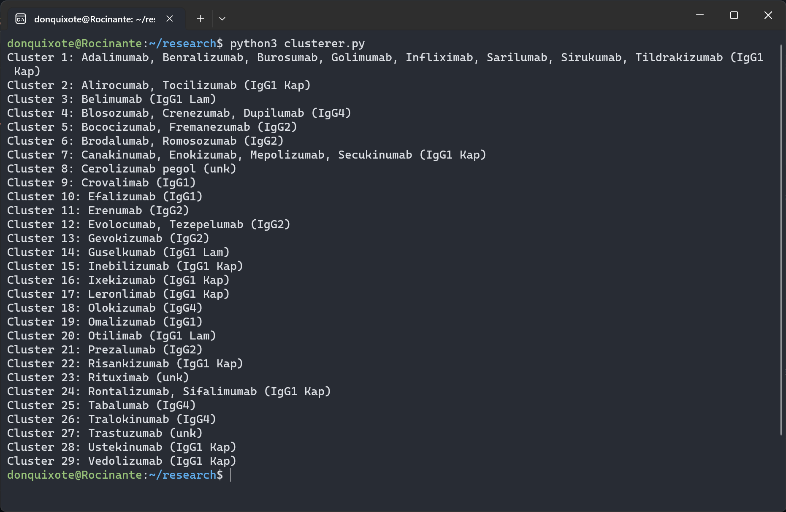

* this program was to cluster the antobodies in groups by their constant regions. 
* The sequences file contains rows with the INPN, the heavy chain constant region, the light chain region, and the type of antibody. 
* The program searches the file for rows with matching values in columns 2, 3, and 4 and return the clusters.
Output shown here:

* There are 2 .csv files because I edited it to not have the variable region in the .csv to make the program simpler
* Since I did this, the program just looks for matching rows and doesn't have to search for the variable regions on each row
